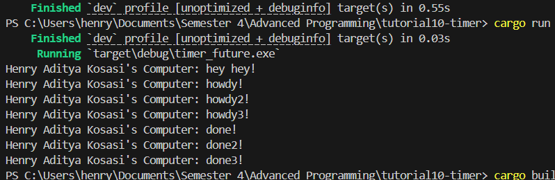

# Experiment README
## 1.2 Understanding how it works

  
Pesan hey hey muncul terlebih dahulu karena future di Rust bersifat lazy. Yang dimaksud dengan lazy berarti dia tidak langsung dijalankan saat dibuat, tetapi hanya dimasukkan ke dalam task queue. Fungsi spawner.spawn() hanya memasukkan asynchronous task yaitu future ke dalam queue yang nanti akan dijalankan oleh executor. Namun, eksekusi task tersebut baru dijalankan saat executor.run() dipanggil, yang akan mulai polling task-task yang ada di dalam queue. Sementara itu println!("Henry Aditya Kosasi's Computer: hey hey!"); adalah code biasa yang bersifat synchronous, sehingga bisa langsung diexecute. Kalau tadi println hey hey ditaruh dibawah executor.run(), baru hey hey akan diprint di bawahnya howdy dan done.

  

## 1.3: Multiple Spawn and removing drop
### Dengan Drop

### Tanpa Drop

  
Dapat dilihat kalau drop(spawner) tidak dipanggil, maka program tidak akan pernah selesai karena executor akan terus menunggu task baru masuk ke dalam queue. Hal ini terjadi karena selama spawner masih ada, executor menganggap bahwa masih ada kemungkinan task baru akan dikirimkan melalui spawner tersebut. Akibatnya, meskipun semua task yang sudah ada di queue telah selesai dijalankan, executor tetap berjalan dan tidak pernah keluar dari loop-nya. Dengan memanggil drop(spawner), kita memberi tahu executor bahwa tidak akan ada task tambahan yang dikirim, sehingga ketika queue task kosong, executor bisa menyelesaikan eksekusinya dan program pun selesai. Tanpa drop(spawner), program seperti “menunggu terus” walaupun sebenarnya tidak ada lagi yang perlu dikerjakan.
